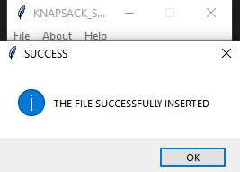

# KNAPSACK PROBLEM SOLVER

# FILE MENU

## Insert a file

You can insert a file using menu File --> Insert a file or by using Ctrl + O keybind

 

if you cancel insertion an informative message pops up

 

else

 

## Close file

You can close a file using File --> Close file or by using Ctrl + F5 keybind

 

if there is no file imported an error message window pops up

 

else a success message window pops up

 

## Exit

You can close the app using menu File --> Exit or using Alt+F4 keybind

 

An informative message pops up

 

You press ok to close the app or cancel if you don't want
